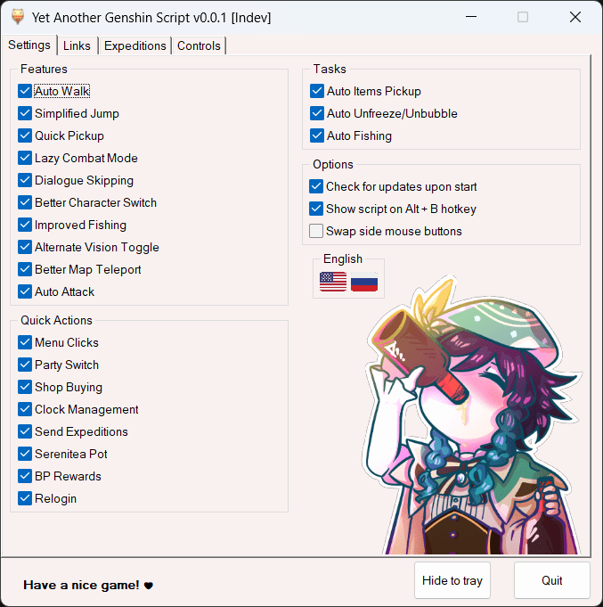

## 🎈 [ĐANG PHÁT TRIỂN] Yet Another Genshin Script

<table>
  <tr>
    <td valign="center"><a href="README.md"> English</td>
    <td valign="center"><a href="README_RU.md"> Русский</a></td>
    <td valign="center"> Tiếng Việt</td>
  </tr>
</table>

YAGS được làm ra để giúp cho việc chạy daily bớt khó khăn hơn <3.

Script này sẽ cải thiện việc điều khiển, tự động tuần hoàn nhiều thứ, và mang thêm một số những phím tắt hữu ích.

**Lưu ý**: Script chỉ hoạt động khi đang để độ phân giải game **1920x1080** trong chế độ [cửa sổ không viền](https://gaming.stackexchange.com/a/376533) với 60FPS và ping ổn định (cũng không cần thiết nhưng sẽ có một vài thứ *có thể* không hoạt động được như mong đợi).

Hiện tại chúng tôi không có ý định thêm tuỳ chỉnh độ phân giải khác ở tương lai gần.

---

### ❓ Hướng dẫn sử dụng
1. Giải nén và chạy script. Chọn một trong các lựa chọn sau:
  - Sử dụng release build (khuyến nghị)
    - [Tải xuống](https://github.com/SoSeDiK/YAGS/releases/latest/download/YAGS.exe) phiên bản script mới nhất và đưa nó vào thư mục bất kì.
		- Chạy `YAGS.exe` với **quyền admin**.
  - Sử dụng development build:
    - Tải và cài đặt [AutoHotkey](https://www.autohotkey.com/) (❕yêu cầu có version 2❕).
    - Tải repository này, giải nén thư mục `YAGS` ra.
    - Chạy `YAGS.ahk`.
    - (!) Nên nhớ rằng, development builds không có tự động cập nhật khi chúng tôi cho ra mắt phiên bản mới.
2. Tuỳ chỉnh những thứ bạn cần trong GUI nếu cần.
3. Chạy game để trải nghiệm.
4. Nhấn `Alt + B` để hiện script nếu cần.
5. Nhấn `End` trong trường hợp bạn cần dừng script ngay lập tức.

**Note:** để cho script hoạt động ok, thì script phải được chạy với quyền admin. Bởi vì nếu không, nó sẽ không xử lí nhập liệu của bàn phím và chuột của AHK một cách trơn tru.

---

### 🎨 Chức năng
- Giữ `F` để spam `F` >:)
- Giữ `XButton1` để spam `F` nhiều hơn!
  - Vì vài lí do, Dùng phím trên chuột sẽ dễ hơn cho tôi là bấm `F`.
  - Bạn có thể dùng chức năng này để skip các đoạn hội thoại (dĩ nhiên là bạn sẽ vẫn phải tự chọn các đoạn hội thoại).
- Nhấn `XButton1` để nhấn `T` (để bay theo các Ấn Bốn Lá chỉ với việc nhấp chuột).
- Giữ `Space` để nhảy liên tục.
  - Có thể dùng như là Bunnyhop (nhấn giữ nút chạy rồi bắt đầu nhảy liên tục).
- Giữ `XButton2` cũng dùng để nhảy liên tục!
  - Đúng, tôi rất là lười nhấn giữ nút `Spacebar`. Bunnyhop cũng vậy.
  - Cũng hoạt động với Thuyền gió.
  - Có thể dùng để skip các đoạn hội thoại, nhưng hơn nữa cũng tự động chọn những lựa chọn trong nhiệm vụ **nếu khả thi**, hoặc chọn sự lựa chọn hội thoại dòng cuối.
- Giữ phím từ `1 đến 5` để đổi nhân vật nhanh hơn.
- Nhấn `MMB` để bật chế độ ĐI BỘ!
  - Nhấn `RMB` để bật chế độ Chạy khi đang trong chế độ Tự Đi Bộ.
  - `LShift` có thể dùng cho việc chạy như bình thường.
- Nhấn `H` để bật Góc Nhìn Nguyên Tố!
  - Làm vậy để dễ hơn nhiều so với việc bạn phải nhấn giữ chuột giữa.
- Giữ `V` để auto attack!
  - Ở chế độ mặc định. Nhấn `Numpad *` + `Numpad 1-4` để đổi các chế độ có sẵn:
    - `1`: Klee Simple Jump Cancel (NJ)
    - `2`: Klee Trọng Kích (CJ)
    - `3`: Hu Tao Dash Cancel (9N2CD)
    - `4`: Hu Tao Jump Cancel (9N2CJ)
  - Chắc chắn sẽ được làm lại ở tương lai và hỗ trợ thêm nhiều nhân vật nữa.
- Nhấn `MMB` trên bản đồ để Dịch chuyển nhanh chóng.
  - Chắc chắn là hữu dụng khi có nhiều các icon gần với điểm dịch chuyển. Giảm một vài cú click chuột, vài giây, tiết kiệm thời gian.

### ✨ Bổ sung nhỏ (có thể hữu ích)
- Nhấn `MMB` để:
  - Chọn và ghép tối đa quặng (hoặc một vài thứ ở menu của Thợ Rèn).
  - Nhận các vật phẩn đã ghép.
  - Khoá/Mở Khoá thánh di vật hoặc vũ khí.
  - Nâng cấp thánh di vật/ vũ khí.
  - Nhấn phím «Ghép»/«Chuyển đổi» ở Đài Ghép.
  - Hơn nữa, dùng `XButton1` và `XButton2` bạn có thể nhấn «+» và «-» để tăng số lượng hoặc giảm số lượng vật phẩm cần ghép.
  - Thực hiện đổi Tráp Thánh.
  - Nhấn nút «Xác nhận» ở một vài cái bảng hiện lên.
  - Nhận Xu và Kinh nghiệm yêu thích trong Ấm Trần Ca.
  - Nhấn «Tiếp tục» ở trong Bí Cảnh.
  - Nhấn «Bỏ Qua» ở trong Bí Cảnh/Cầu Nguyện/Cutscenes.
  - Chuyển đổi chế độ «Tự động chạy cốt truyện» trong hội thoại.
- Nhấn `XButton1` để mua vật phẩm nhanh chóng từ cửa hàng.
  - Nhấn `XButton2` để mua các vật phẩm liên tục. Nhấn tại lần nữa để dừng.
- `Numpad +` + `Numpad 0-9` để đổi đội hiện tại (0 là 10)
- `Numpad -` + `Numpad 5` để đi đến Ấm trần ca (thông qua Ấm trong túi đồ).
- `Numpad -` + `Numpad 6` để nhận và gửi đi thám hiểm lại (dùng GUI để tuỳ chỉnh),
- `Numpad -` + `Numpad 8` để nhận tất cả kinh nghiệm và phần thưởng.
- `Numpad -` + `Numpad .` đăng nhập lại.
  - Hữu dụng cho việc reset boss.
- `Numpad /` + `Numpad 1-9` để thay đổi thời gian nhanh.
  - Về các con số trong đồng hồ của game:
    - Bàn phím số:    Thời gian:
    - `7` `8` `9`   ` 9` `12` `15`
    - `4` ` ` `6`   ` 6` `  ` `18`
    - `1` `2` `3`   ` 3` `24` `21`
    - ` ` `0` `.`   `  ` `+1` `-1`
  - Ví dụ, `Numpad /` + `Numpad 7` sẽ chỉnh thời gian đến `9`.
  - Nhấn `Numpad 0` trong khoảng giữa của phím tắt trên để thêm 1 giờ. Ví dụ, `Numpad /` + `Numpad 0` + `Numpad 7` sẽ chỉnh thời gian đến `10`.
  - Nhấn `Numpad .` trong khoảng giữa của phím tắt trên để trừ đi 1 giờ. Ví dụ, `Numpad /` + `Numpad 0` + `Numpad 7` sẽ chỉnh thời gian đến `8`.
  - Nhấn `Numpad *` trong khoảng giữa của phím tắt trên để thêm 24 giờ. Ví dụ, `Numpad /` + `Numpad *` + `Numpad 7` sẽ chỉnh thời gian đến `9` giờ ngày hôm sau.
  - Và đúng rồi, `Numpad /` + `Numpad *` + `Numpad 0` + `Numpad 7` sẽ chỉnh thời gian đến `10` giờ ngày hôm sau.
    - Với `/` để nhấn, `*` là ngày hôm sau, `0` là thêm 1 giờ, `7` là 9 giờ. Hôm sau vào lúc 9 giờ + 1 = 10 giờ. Đơn giản đúng không ? :)
  - Với một vài bàn phím sẽ giới hạn những tổ hợp phím này, nhưng bạn sẽ không cần chức năng này một cách thường xuyên đâu.
  - `Numpad /` + `Numpad 5` chỉ để mở giao diện đồng hồ cho bạn.

### 🎣 Tự động hoá (Có thể chuyển đổi)
- Tự động nhặt.
  - Hoạt động với vài nhắc nhở nữa. Ví dụ: Bỏ qua hội thoại, nấu nướng và khiêu chiến.
- Tự động thoát khỏi đóng băng/bong bóng thuỷ.
- Tự động câu cá.
  - Bạn chỉ cần thả cần câu. Kéo và bắt cá sẽ được hoàn thành một cách tự động.
  - Bây giờ bạn chỉ nên nhấn `LMB` để chuyển đổi chế độ chả cần câu thay vì giữ.
- Easier/Lazy combat.
  - Giữ `LMB` để spam đánh thường.
  - Nhấn `RMB` để thực hiện đòn trọng kích.
    - Với một vài nhân vật có các loại đòn trọng kích khác nhau dựa trên khoảng thời gian giữ. Bạn có thể giữ `RMB` thêm 1 ít nếu cần.

### ⚙ Thông tin thêm
Tất cả các links sẽ được để trong file `yags_data/links.ini`. Bạn có thể xoá hoặc thêm các thứ mà bạn muốn.

Chỉ trong trường hợp:
- `LMB`: Chuột Trái
- `RMB`: Chuột Phải
- `MMB`: Chuột Giữa
- `XButton1`: Phím bên của Chuột 1
- `XButton2`: Phím bên của Chuột 2

Các hoạt động của `XButton1` và `XButton2` có thể bị đổi.

---

## ⚠ Miễn trừ trách nhiệm
Cho dù Script này không có bao gồm các phần mềm gian lận can thiệp, bạn vẫn phải chịu rủi ro khi sử dụng nó.

**Không được nói cho người khác biết về việc bạn sử dụng phần mềm thứ 3**. Bạn đã được cảnh cáo trước.

---

Script này được lấy cảm hứng từ các Genshin Impact AHK Scripts khả dụng. Hãy ghé để check qua họ nhé!
- [BGC script](https://github.com/onoderis/bgc-script)
- [Genshi AHK Flex](https://github.com/Kramar1337/GenshinImpact-AHK-flex)
- [genshin-impact-script](https://github.com/phonowell/genshin-impact-script)

Cảm ơn [ImagePut](https://github.com/iseahound/ImagePut) vì đã tạo nội dung đồ hoạ cho `YAGS`.

Ảnh venti được vẽ bởi [@ACenturyMage](https://twitter.com/ACenturyMage/status/1325869153618718720).

Cờ quốc gia đến từ. [Twemoji](https://twemoji.twitter.com/).

Readme Tiếng Việt được dịch bởi: [TeddDepTrai](https://github.com/tedddeptrai)
